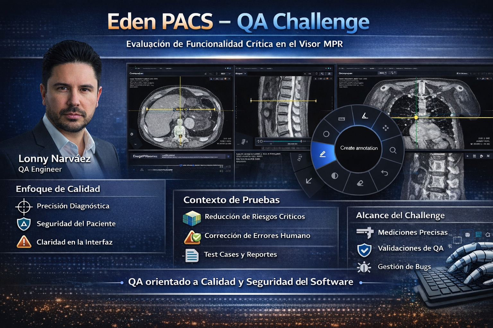

# Eden PACS – QA Challenge



## Propósito

Este repositorio documenta el análisis funcional y de calidad de la herramienta **Length** dentro del visor MPR de Eden PACS, con énfasis en el **comportamiento del menú circular** y su impacto en la experiencia del usuario.

El objetivo no es únicamente validar que la herramienta funcione, sino analizar cómo se comporta en escenarios de uso real, poniendo especial atención en la claridad visual, la legibilidad y la coherencia durante el uso cotidiano del visor.

El contenido refleja escenarios de uso práctico, un comportamiento reportado como bug y oportunidades de mejora observadas durante la interacción con la herramienta.

---

## Enfoque de Calidad

En un entorno de diagnóstico médico, la calidad del software tiene implicaciones directas en la toma de decisiones clínicas. Por ello, este challenge se aborda considerando que:

- Los errores pueden impactar la interpretación de un estudio.
- La ambigüedad en la interfaz incrementa el riesgo de uso incorrecto.
- La claridad del estado de las herramientas es clave bajo presión operativa.

El rol de QA, en este contexto, es reducir riesgos y asegurar que el sistema sea confiable y predecible para el usuario final.

---

## Alcance del Challenge

### Herramienta seleccionada del menú circular

**Length**, considerando sus **cuatro formas de medición**:

- Medición lineal básica (por defecto).
- Bidirectional.
- Curve measurement.
- Deviation.

El análisis se centra exclusivamente en esta herramienta y en su interacción con el menú circular, debido a su relevancia clínica, su complejidad geométrica y su sensibilidad a errores de interacción.

Dentro del alcance se incluyen:

- Casos de prueba funcionales.
- **1 Bug report** relacionado al comportamiento del menú circular.
- **1 Feedback report** enfocado en usabilidad y experiencia visual.

---

## Contexto de Pruebas

- **Aplicación:** Eden PACS – Visor MPR  
- **Funcionalidad:** Multiplanar Reconstruction (MPR)  
- **Planos evaluados:** Axial, Coronal, Sagital  

Aspectos clave considerados:

- Coherencia espacial entre planos.
- Identificación clara del plano activo.
- Estados explícitos de las herramientas.
- Capacidad de recuperación ante errores del usuario.

---

## Estructura del Repositorio

```
EDEN-PACS-QA-CHALLENGE
├── assets                # Visual and video evidence
│   ├── eden-pacs-qa-challenge.png
│   ├── length-overlay-visibility.mov
│   └── length-overlay-visibility.png
├── length                # Length measurement feature analysis
│   ├── bugs.md           # Identified issues
│   ├── feedback.md       # UX and functional feedback
│   ├── overview.md       # Feature overview and scope
│   └── testcases.md      # Test cases and scenarios
└── README.md
```
---

## Enlaces Directos

- [Descripción funcional](length/overview.md)
- [Casos de prueba](length/testcases.md)
- [Bug report](length/bugs.md)
- [Feedback](length/feedback.md)

---

## Evidencia visual

En la carpeta `/assets` se incluye evidencia visual que documenta escenarios de uso donde la interacción con el menú circular permite la creación consecutiva de múltiples mediciones y anotaciones.

La evidencia muestra que, aunque las anotaciones pueden moverse manualmente, la disposición inicial de los elementos puede generar superposición temporal entre mediciones, anotaciones y la información contextual del visor (por ejemplo, zoom, posición o valores en pantalla).

Este material sirve como apoyo tanto para el bug report como para el feedback documentado en `length/bugs.md` y `length/feedback.md`.

---

## Enfoque de Diseño de Pruebas

Este análisis prioriza:

- Comprensión del usuario clínico.
- Escenarios de uso real y continuo.
- Claridad visual y reducción de carga cognitiva.
- Confianza en la lectura de la información clínica.

Los casos de prueba se priorizan considerando:

1. Impacto potencial en la interpretación clínica.
2. Frecuencia de uso de la funcionalidad.
3. Riesgo asociado a errores humanos.
4. Claridad de la interacción bajo carga cognitiva.

**Prioridades:**

- **Alta:** Riesgo funcional o clínico.
- **Media:** Claridad de uso y prevención de errores.
- **Baja:** Comportamientos visuales.

---

## Consideración de Error Humano

Se asume que los usuarios pueden cometer errores durante la interacción con la herramienta. Por ello, se pone especial atención en escenarios como:

- Mediciones incompletas o accidentales.
- Cambio de plano o slice durante una medición.
- Activación consecutiva de herramientas desde el menú circular.
- Necesidad de corrección manual sin romper el flujo de trabajo.

El sistema debe facilitar la detección y corrección de estos errores sin comprometer la lectura ni la continuidad del estudio.

---

## Observaciones generales

Durante el análisis se identificaron algunos puntos transversales que, sin constituir fallos funcionales, son relevantes desde la perspectiva de calidad y uso real:

- El menú circular facilita un flujo de trabajo rápido, pero su uso intensivo puede incrementar la carga visual si no existe una gestión automática de la disposición inicial de los elementos.
- La herramienta Length es sensible a cambios de contexto (plano, slice, zoom), por lo que la claridad del estado activo es clave para evitar errores no intencionados.
- En escenarios reales, el usuario prioriza velocidad sobre orden visual inmediato, lo que refuerza la importancia de comportamientos por defecto seguros.

---

### Identificación de edge cases

Algunos escenarios que merecen atención especial durante pruebas continuas:

- Cambio de plano o slice mientras una medición Length está en progreso.
- Uso consecutivo de diferentes formas de medición sin pausa entre acciones.
- Alta densidad de mediciones y anotaciones en un mismo plano.
- Interacción con herramientas de zoom o navegación mientras existen mediciones activas.

---

### Riesgos de usabilidad o seguridad

- **Usabilidad:** Saturación visual que dificulta la lectura simultánea de la imagen clínica y los datos contextuales.
- **Seguridad clínica:** Riesgo de interpretación incorrecta si una medición se asume asociada a un plano o slice equivocado.

Estos riesgos no implican necesariamente un fallo del sistema, pero sí áreas donde pequeños ajustes pueden tener un impacto positivo significativo.

---

### Perspectiva de automatización

La automatización se considera como un complemento al análisis manual, no como un reemplazo.

**Qué automatizaría:**

- Activación y cambio de herramientas desde el menú circular.
- Persistencia y limpieza de estados al cambiar de plano o slice.
- Comportamientos generales del menú circular.

**Qué no automatizaría prioritariamente:**

- Validaciones visuales finas.
- Precisión clínica de las mediciones.

**Por qué:**  
Estas validaciones dependen fuertemente del contexto visual y de la percepción del usuario.

**Cómo lo haría:**

- Pruebas automatizadas a nivel UI para flujos críticos del menú circular.
- Validaciones de estado desacopladas de la capa visual.
- Pruebas manuales exploratorias para escenarios complejos o de alta carga cognitiva.

---

## Nota Final

Este challenge se aborda como un ejercicio de QA aplicado a un entorno real de diagnóstico médico. El objetivo es evaluar el comportamiento de la herramienta y del menú circular desde un punto de vista funcional, de usabilidad y de reducción de riesgos, manteniendo siempre el foco en la confiabilidad del sistema.

---

**Candidato:** Lonny Narváez  
**Rol:** QA Engineer
